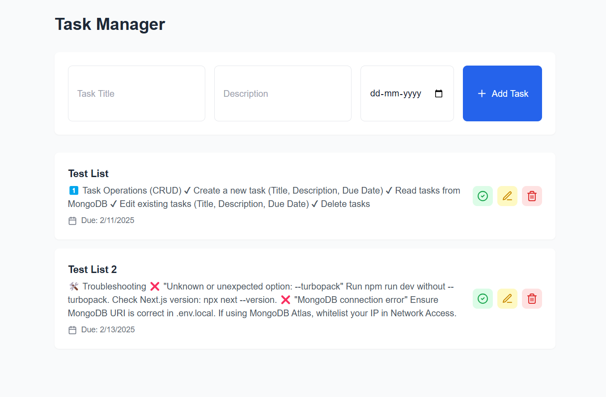
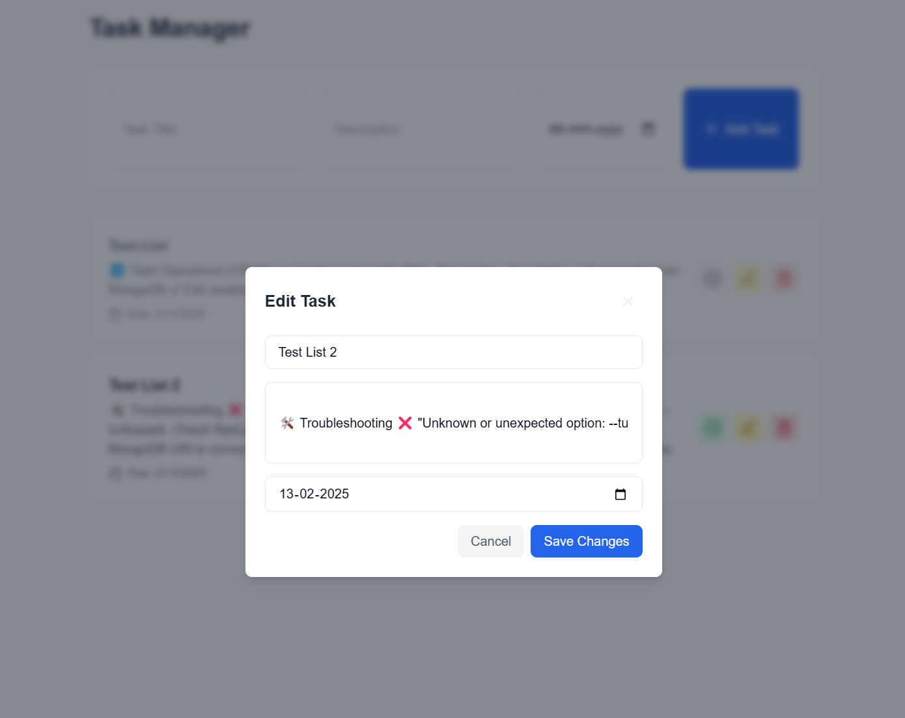
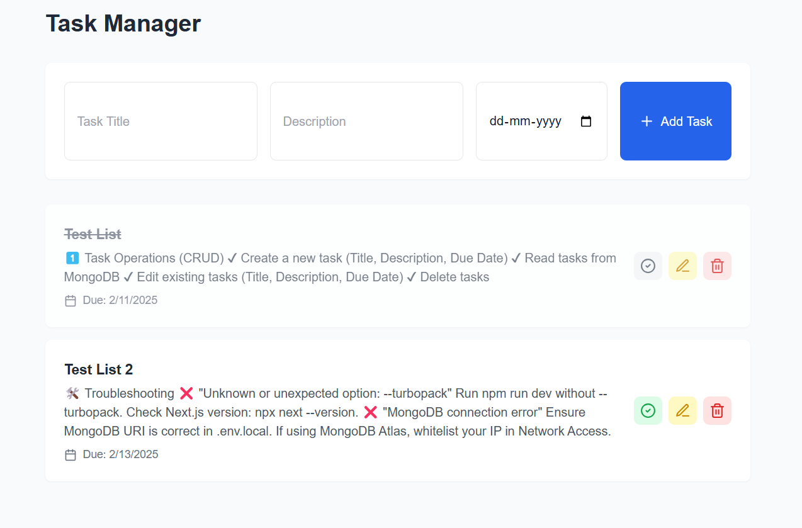

# 📝 Task Management App

A simple **Task Management application** built with **Next.js** (latest version) using **Server Actions** for backend operations and **MongoDB** for data persistence. Users can:

👉 **Create, edit, delete tasks**  
👉 **Mark tasks as complete/incomplete**  
👉 **Store and retrieve tasks from MongoDB**  
👉 **Deploy on Vercel**  

---

## **🚀 Tech Stack Used**
| Technology  | Purpose |
|-------------|---------|
| **Next.js** | Full-stack framework for React with Server Actions |
| **React.js** | Frontend UI components |
| **Server Actions** | Handles backend logic (CRUD operations) |
| **MongoDB** | Stores task data persistently |
| **Mongoose** | ODM to interact with MongoDB |
| **Tailwind CSS** | Styling for the UI |
| **Vercel** | Deployment |

---

## **📂 Project Structure**
```
/task-manager-app
 ├── /app
 │   ├── /api
 │   ├── /components
 │   ├── page.js  # Main UI (Task List & Forms)
 │   ├── actions.js  # Server Actions (CRUD)
 │   ├── layout.js  # Next.js layout
 │── /models
 │   ├── Task.js  # Task Schema for MongoDB
 │── /lib
 │   ├── db.js  # Database Connection
 │── /public
 │── .env.local  # Environment Variables
 │── package.json
 │── README.md  # Documentation
```

---

## **🛠️ Setup Instructions**

### **1️⃣ Clone the Repository**
```sh
git clone https://github.com/your-username/task-manager-app.git
cd task-manager-app
```

### **2️⃣ Install Dependencies**
```sh
npm install
```

### **3️⃣ Configure Environment Variables**
Create a `.env.local` file in the root directory and add:
```env
MONGODB_URI="connection string"

```

### **4️⃣ Run Locally**
```sh
npm run dev
```
The app will run at **`http://localhost:3000`** 🎉.

---

## **💾 MongoDB Setup**
If you haven't set up a MongoDB database:
1. Sign up at [MongoDB Atlas](https://www.mongodb.com/atlas/database).
2. Create a **new cluster**.
3. Click "Connect" → Choose "Connect your application".
4. Copy the **MongoDB Connection String** and update your `.env.local` file.

---

## **📝 Features & Functionalities**
### **1️⃣ Task Operations (CRUD)**
✔ **Create** a new task (Title, Description, Due Date)  
✔ **Read** tasks from MongoDB  
✔ **Edit** existing tasks (Title, Description, Due Date)  
✔ **Delete** tasks  

### **2️⃣ Mark Task as Complete/Incomplete**
✔ Toggle task completion with a single button  

### **3️⃣ Real-Time Updates**
✔ Updates the UI instantly after adding, editing, deleting, or marking a task as complete.

---

## **🖥️ Deployment on Vercel**
### **1️⃣ Install Vercel CLI**
```sh
npm install -g vercel
```

### **2️⃣ Login to Vercel**
```sh
vercel login
```

### **3️⃣ Deploy the App**
```sh
vercel
```
This will generate a **Vercel Deployment URL**.

---

## **🖼️ Screenshots**
### **Task List View**


### **Edit Task Modal**


### **Completed Task Modal**



---

## **📎 API Reference**
### **1️⃣ Fetch All Tasks**
```http
GET /api/tasks
```
**Response:**
```json
[
  {
    "_id": "65f8e1e7a17f2e001c93abcd",
    "title": "Complete Project",
    "description": "Finish the Next.js project",
    "dueDate": "2025-02-15",
    "completed": false
  }
]
```

### **2️⃣ Create a Task**
```http
POST /api/tasks
```
**Request Body:**
```json
{
  "title": "Write Documentation",
  "description": "Create README file",
  "dueDate": "2025-02-10"
}
```

### **3️⃣ Update a Task**
```http
PUT /api/tasks/:id
```
**Request Body:**
```json
{
  "title": "Updated Task",
  "description": "Updated details",
  "completed": true
}
```

### **4️⃣ Delete a Task**
```http
DELETE /api/tasks/:id
```

---

## **🛠️ Troubleshooting**
### **❌ "Unknown or unexpected option: --turbopack"**
- Run **`npm run dev`** **without** `--turbopack`.
- Check Next.js version: `npx next --version`.

### **❌ "MongoDB connection error"**
- Ensure **MongoDB URI** is correct in `.env.local`.
- If using MongoDB Atlas, **whitelist your IP** in **Network Access**.

---


